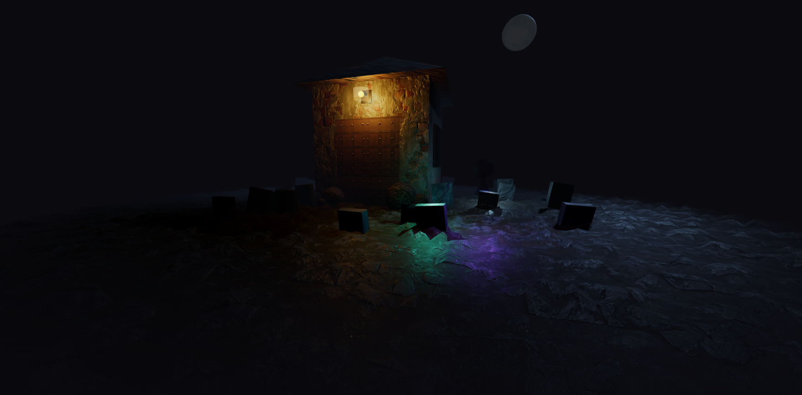

# Haunted House 3D

A spooky 3D haunted house built with Next.js 15, Three.js, React Three Fiber, and Drei.



---

## 🔗 Live Demo

🌐 **Check it out here:**  
[https://3d-haunted-house.vercel.app](https://3d-haunted-house.vercel.app)

---

## 🧩 Features

- 🏚️ **Procedural Haunted House**: Built entirely with basic geometry – no external 3D models.
- 👻 **Animated Ghosts**: Lights with spectral bodies that orbit, fade and reappear mysteriously.
- 💡 **Realistic Lighting**: Full moonlight, interior glows, torches and shadows.
- 🪟 **Custom Window System**: With rusty bars and aged wooden panels.
- 🚪 **Displaced Door Material**: Uses full PBR maps for realistic detail and surface depth.
- 🌫️ **Volumetric Fog**: Creates a dense, mysterious atmosphere.
- 🌓 **Dynamic Moon**: With texture, directional light, and natural low horizon placement.
- 🪴 **Foliage and Bushes**: Placed to enhance the haunted yard.
- 🔮 **Optimized Shaders**: Fresnel effects, emissive materials, and selective reflectors.
- 🎮 **Responsive Camera Controls**: With restricted vertical movement and touch support.

---

## 🛠️ Tech Stack

**Frontend:**
- [Next.js 15](https://nextjs.org/)
- [React 18](https://react.dev/)
- [React Three Fiber](https://docs.pmnd.rs/react-three-fiber/getting-started/introduction)
- [Drei](https://github.com/pmndrs/drei)

**3D & Graphics:**
- [Three.js](https://threejs.org/)

**Tooling:**
- [ESLint](https://eslint.org/)
- [Prettier](https://prettier.io/)

---

## 🚀 Getting Started

Clone the repository:

```bash
git clone https://github.com/cpl121/haunted-house-3d.git
cd haunted-house-3d
```
# 2. Install dependencies
```bash
npm install
```
# 3. Run the dev server
```bash
npm run dev
```
